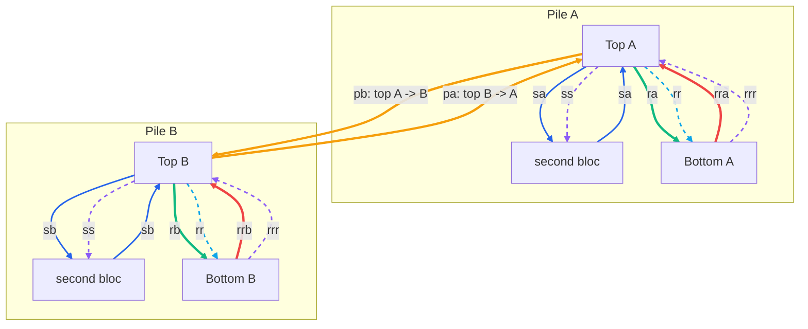
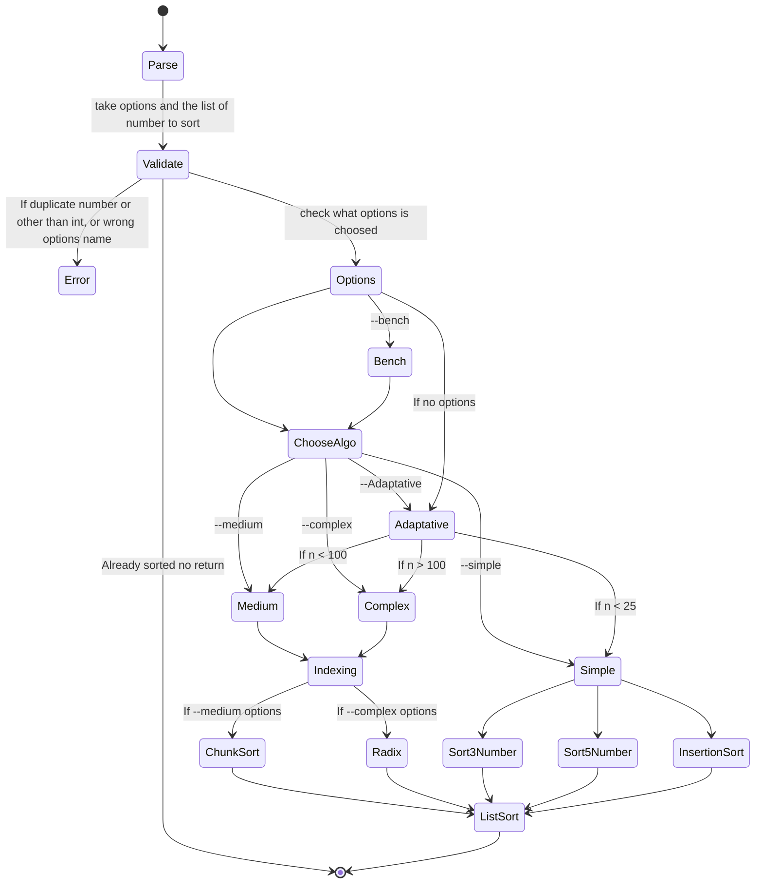

# Push Swap
This activity has been created as part of the 42 curriculum by <hugodavid-42> <psi-mous> psi-mous and hdavid

## Description
Push_swap is a project that sorts a stack of integers using a restricted set of operations.  
The challenge is to design an efficient algorithm that minimizes the number of moves required to sort the data. It will count the operations and print the movements used.


## Instructions

Compile with `make` and lunch the program with `./push_swap`.
All the options :
* `--simple` sort with the simples algos (Sort3 / Sort5 / Insertion sort) in [easy_algos.c](easy_algos.c)
* `--medium` sort with the medium algo (chunk sort) in [medium_algo.c](medium_algo.c)
* `--complex` sort with the complex algo (radix) in [complex_algo.c](complex_algo.c)
* `--adaptative`
* `--count_only` don't print the operations but only the count of operations
* `--bench` print all the informations about the sorting method used.

Example :

```bash
make
```
```bash
./push_swap --bench --adaptative "9 6 4 7 2"
```
or
```bash
./push_swap --bench --adaptative 9 6 4 7 2
```
return

```bash
[bench] disorder: 33.33%
[bench] strategy: Adaptive / O(n√n)
[bench] total_ops: 9
[bench] sa: 0 sb: 0 ss: 0 pa: 4 pb: 4
[bench] ra: 1 rb: 0 rr: 0 rra: 0 rrb: 0 rrr: 0
```
Without options

```bash
./push_swap 3 2 1
```
return
```bash
sa
rra
```

## Choice of the algorithms

**Big-O Complexity**

<p align="center">
  
</p>

* Insertion sort -> O(n^2)
* Chunk sort -> O(n√n)
* Radix -> O(log(n))

### Movements authorized

- Two stacks (`a` and `b`) used for sorting.
- Limited set of operations:
  - `sa` / `sb` / `ss` → swap the top elements
  - `pa` / `pb` → push elements between stacks
  - `ra` / `rb` / `rr` → rotate stack upwards
  - `rra` / `rrb` / `rrr` → rotate stack downwards
- Input validation (only integers, no duplicates).
- Optimized sorting algorithm for different input sizes.



### Resume of the program

 *Program Flow (Simplified)*
 
| Step | Action |
| ---- | ------ |
| Parse	| Read options and list of numbers |
| Validate | Check input correctness, duplicates, and option names |
| Options	| Choose algorithm mode (simple, medium, complex, adaptative) |
| ChooseAlgo | Select specific algorithm based on option or input size |
| Algorithm	| Run sorting method (Insertion, ChunkSort, Radix, etc.) |
| ListSort |	Produce final sorted list |
| End |	Exit program |


 *Program Flow (diagram)*




## Resources

**Documentation references used during development:**
- [GeeksforGeeks](https://www.geeksforgeeks.org/)
- IA helped us to understand some algorithms and write the Readme
- [Mermaid](https://www.mermaidchart.com/) - for the graphic in the Readme

